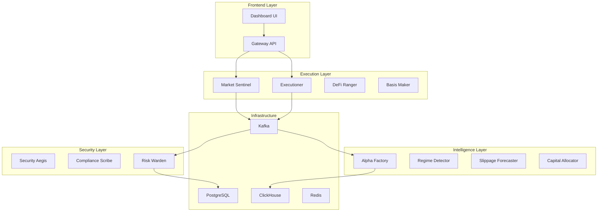

# LAV/ADAF v1.3 - Sistema Integral de Agentes de Trading Cuantitativo

<div align="center">


**Sistema de Agentes de Inteligencia para Trading Algorítmico y Gestión de Riesgo**

[](https://github.com/lav-adaf/monorepo/actions)
[](https://codecov.io/gh/lav-adaf/monorepo)
[](https://hub.docker.com/r/lav-adaf/gateway)
[](LICENSE)

</div>

## 🚀 Quick Start

```bash
# 1. Clonar y configurar
git clone https://github.com/lav-adaf/monorepo.git lav-adaf
cd lav-adaf
cp .env.example .env

# 2. Instalar dependencias
pnpm install
cd apps/alpha-factory && poetry install --no-dev

# 3. Levantar infraestructura
docker compose up -d postgres clickhouse redis kafka grafana

# 4. Ejecutar migraciones
pnpm db:migrate

# 5. Iniciar servicios core
make start-core

# 6. Verificar deployment
make smoke-test
```

**Acceso:**
- 🌐 **Gateway API**: http://localhost:3000
- 📊 **Grafana**: http://localhost:3001 (admin/admin)
- 🔍 **Dashboard**: http://localhost:3005

---

## 📋 Tabla de Contenidos

- [Arquitectura](#arquitectura)
- [Servicios y Agentes](#servicios-y-agentes)
- [APIs Disponibles](#apis-disponibles)
- [Desarrollo Local](#desarrollo-local)
- [Deployment](#deployment)
- [Monitoreo y Observabilidad](#monitoreo-y-observabilidad)
- [Seguridad y Compliance](#seguridad-y-compliance)
- [Contribución](#contribución)

---

## 🏗️ Arquitectura

### Stack Tecnológico

- **Backend**: TypeScript/Node.js + Next.js 15
- **ML/Quant**: Python 3.11 + Poetry
- **Mensajería**: Apache Kafka / NATS
- **Bases de Datos**: PostgreSQL + ClickHouse + Redis
- **Orquestación**: Docker Compose + Prefect
- **Observabilidad**: OpenTelemetry + Prometheus + Grafana
- **Seguridad**: Fireblocks + Gnosis Safe + Forta

### Diagrama de Alto Nivel



---

## 🤖 Servicios y Agentes

### Core Trading Agents

| Agente | Puerto | Descripción | DoD |
|--------|--------|-------------|-----|
| **Market Sentinel** | 3010 | Diales de mercado + señales régimen | Latencia <60s, precisión ≥70% |
| **Executioner** | 3011 | Router TWAP/VWAP + simulación | Fill-rate ≥95%, tracking <15bps |
| **Risk Warden** | 3012 | VaR + límites + paradas | VaR 1d ≤3% NAV, DD stop operativo |

### DeFi & Trading Agents

| Agente | Puerto | Descripción | DoD |
|--------|--------|-------------|-----|
| **DeFi Ranger** | 3020 | Gestión colateral LTV/HF | HF ≥1.60, LTV ≤0.30 |
| **Basis Maker** | 3021 | Cash-and-carry automation | PnL neto positivo, hedge 1:1 |
| **Pendle Alchemist** | 3022 | PT/YT rotation + rolls | YT ≤15% cartera, implied > hurdle |
| **RWA Steward** | 3023 | Gestión assets reales | Desvío NAV <X bps |

### Intelligence & ML Agents

| Agente | Puerto | Descripción | DoD |
|--------|--------|-------------|-----|
| **Alpha Factory** | 4010 | Feature store + backtests | Reproducibilidad 100% |
| **Regime Detector** | 4011 | HMM + cambios régimen | Precisión ≥70% |
| **Slippage Forecaster** | 4012 | Predicción impacto mercado | MAPE <15% |
| **Capital Allocator** | 4013 | Multi-armed bandits | Converge 60-90d |

### Security & Compliance

| Agente | Puerto | Descripción | DoD |
|--------|--------|-------------|-----|
| **Security Aegis** | 5010 | MPC + rotación claves | RTO <60min |
| **Compliance Scribe** | 5011 | KYT + sanción lists | 0 flags críticos |
| **Governance Voice** | 5012 | DAO voting + conflict mgmt | Dry-run antes ejecución |

---

## 🌐 APIs Disponibles

### Gateway Endpoints

```typescript
// Status y Control
GET  /api/status              // Health check completo
GET  /api/limits              // Límites activos por strategia
GET  /api/positions           // Posiciones consolidadas
GET  /api/pnl                // P&L por sleeve/estrategia

// Datos de Mercado
GET  /api/signals/regime      // Estado régimen actual
GET  /api/market/dials        // 5 diales + ETF flows
GET  /api/derivs/funding      // Funding rates multi-exchange
GET  /api/derivs/gamma        // Gamma exposure por tenor

// Ejecución
POST /api/orders/intent       // Nueva orden/intent
GET  /api/orders/status/:id   // Estado ejecución
POST /api/orders/cancel/:id   // Cancelar orden

// Governance
GET  /api/governance/proposals // Propuestas activas
POST /api/governance/vote     // Emitir voto
GET  /api/governance/positions // Posiciones governance
```

### Event Streams (Kafka Topics)

```yaml
signals.regime:
  schema: { ts, regime, dials, score }
  retention: 7d
  partitions: 3

orders.intent:
  schema: { ts, strategy, side, asset, size, limits, hedge }
  retention: 30d
  partitions: 6

risk.limit_violation:
  schema: { ts, limit, value, ctx, action }
  retention: 365d
  partitions: 1

settlement.batch:
  schema: { ts, venue, legs, net, refs }
  retention: 90d
  partitions: 3
```

---

## 💻 Desarrollo Local

### Prerrequisitos

- **Node.js** ≥ 20.0.0
- **pnpm** ≥ 8.0.0
- **Python** 3.11+
- **Poetry** ≥ 1.4.0
- **Docker** + **Docker Compose** ≥ v2.20

### Setup Completo

```bash
# Instalar dependencias
pnpm install
pnpm --filter "./apps/alpha-factory" run poetry:install
pnpm --filter "./apps/regime-detector" run poetry:install

# Setup base de datos
docker compose up -d postgres clickhouse redis
pnpm db:migrate
pnpm db:seed

# Ejecutar tests
pnpm test
pnpm test:integration

# Desarrollo con hot-reload
pnpm dev:core    # Gateway + Market Sentinel + Risk Warden
pnpm dev:defi    # DeFi Ranger + Basis Maker + Pendle
pnpm dev:ml      # Alpha Factory + Regime Detector
```

### Docker Profiles

```bash
# Core services only
docker compose --profile core up

# Con ML/Python services
docker compose --profile ml up

# Full stack incluyendo Solana
docker compose --profile full up

# Solo infraestructura
docker compose --profile infra up
```

---

## 🚀 Deployment

### Staging Environment

```bash
# Build y deploy a staging
make deploy-staging

# Verificar health
make health-check-staging

# Run integration tests
make test-staging
```

### Production Deployment

```bash
# Build production images
make build-prod

# Deploy con zero-downtime
make deploy-prod

# Verificar metrics y logs
make monitor-prod
```

### Variables de Entorno

Ver [`.env.example`](.env.example) para configuración completa.

**Críticas:**
- `POSTGRES_URL`: Conexión base de datos principal
- `CLICKHOUSE_URL`: Analytics y métricas
- `KAFKA_BROKERS`: Mensajería eventos
- `FIREBLOCKS_API_KEY`: Custodia MPC
- `SAFE_ADDRESS`: Multisig address

---

## 📊 Monitoreo y Observabilidad

### Dashboards Grafana

1. **Semáforo LAV** - Estado general sistema
2. **P&L por Sleeve** - Performance financiero
3. **Latencia y Fill-rates** - Métricas ejecución
4. **Violaciones de Límites** - Risk monitoring
5. **Capacidad y Asignación** - Capital allocation

### Alertas Críticas

- VaR 1d > 3% NAV → Slack #risk-alerts
- Fill-rate < 90% → Slack #execution
- DD > -8% → Email + SMS
- Security breach → Slack #security + PagerDuty

### Logs Estructurados

```json
{
  "timestamp": "2025-01-07T10:30:00Z",
  "level": "INFO",
  "service": "executioner",
  "traceId": "abc123",
  "message": "Order filled",
  "metadata": {
    "orderId": "order-456",
    "side": "BUY",
    "fillPrice": 67500.00,
    "slippage": 0.02
  }
}
```

---

## 🔒 Seguridad y Compliance

### Arquitectura de Seguridad

- **Custodia**: Fireblocks MPC + Gnosis Safe 2-de-3
- **KYT**: Mock TRM Labs / Chainalysis
- **Audit**: Logs inmutables via IPFS hash
- **Network**: Allow-lists protocolos y venues

### Políticas de Riesgo

Ver [`docs/policies/`](docs/policies/) para documentación completa:

- [`risk-management.md`](docs/policies/risk-management.md)
- [`execution-policy.md`](docs/policies/execution-policy.md)
- [`incident-response.md`](docs/policies/incident-response.md)

### Controles de Acceso

```yaml
roles:
  trader:
    - orders.create
    - positions.read
  risk_manager:
    - limits.modify
    - positions.force_close
  admin:
    - system.restart
    - configs.modify
```

---

## 🧪 Testing Strategy

### Niveles de Testing

1. **Unit Tests** - Cada agente individualmente
2. **Integration Tests** - Inter-agente communication
3. **Contract Tests** - API contracts via Pact
4. **E2E Tests** - Flujos completos usuario
5. **Chaos Engineering** - Resiliencia sistema

### Coverage Requirements

- **Unit Tests**: ≥ 85%
- **Integration**: ≥ 70%
- **Critical Paths**: 100%

```bash
# Ejecutar test suite completo
make test-all

# Coverage report
make coverage

# Performance benchmarks
make benchmark
```

---

## 📚 Documentación

### Runbooks Operacionales

- [**0-90 Días**](docs/runbooks/0-90-days.md) - Roadmap piloto
- [**Operación Diaria**](docs/runbooks/daily-ops.md) - Tareas rutinarias
- [**Playbooks Trading**](docs/runbooks/trading-playbooks.md) - Estrategias

### Arquitectura Técnica

- [**System Design**](docs/architecture/system-design.md)
- [**Event Schema**](docs/architecture/event-schemas.md)
- [**Database Schema**](docs/architecture/database-schema.md)

### API Documentation

- [**Gateway API**](docs/api/gateway.md)
- [**Agent APIs**](docs/api/agents.md)
- [**Webhook Events**](docs/api/webhooks.md)

---

## 🤝 Contribución

### Development Workflow

1. Fork el repositorio
2. Crear feature branch: `git checkout -b feature/nueva-funcionalidad`
3. Implementar cambios con tests
4. Verificar CI: `make ci-check`
5. Crear Pull Request

### Commit Standards

Usamos [Conventional Commits](https://conventionalcommits.org/):

```bash
feat(market-sentinel): add new funding rate calculation
fix(executioner): resolve TWAP calculation bug
docs(api): update gateway endpoint documentation
```

### Code Review Checklist

- [ ] Tests incluidos y pasando
- [ ] Documentación actualizada
- [ ] No hay secrets hardcodeados
- [ ] Performance impact evaluado
- [ ] Breaking changes documentados

---

## 📈 Métricas y KPIs

### Definition of Done (DoD)

| Componente | Métrica | Objetivo |
|------------|---------|----------|
| **Market Sentinel** | Latencia señales | <60s |
| **Executioner** | Fill-rate | ≥95% |
| **Risk Warden** | VaR 1d | ≤3% NAV |
| **DeFi Ranger** | Health Factor | ≥1.60 |
| **Basis Maker** | P&L neto | Positivo |
| **Security** | RTO incidentes | <60min |

### Reportes Automáticos

- **Diario**: P&L, posiciones, límites
- **Semanal**: Performance vs benchmark
- **Mensual**: Carta a LPs con métricas
- **Trimestral**: Propuesta DAO governance

---

## 📞 Soporte

### Canales de Comunicación

- **Slack**: `#lav-adaf-dev` (desarrollo), `#lav-adaf-ops` (operaciones)
- **Email**: support@lav-adaf.com
- **Issues**: [GitHub Issues](https://github.com/lav-adaf/monorepo/issues)

### Escalation Matrix

| Severidad | Respuesta | Canal |
|-----------|-----------|-------|
| **P0** - Sistema caído | 15min | PagerDuty + Slack |
| **P1** - Funcionalidad crítica | 1h | Slack + Email |
| **P2** - Bug no-crítico | 4h | GitHub Issue |
| **P3** - Enhancement | 1d | GitHub Issue |

---

## 📄 Licencia

Este proyecto está licenciado bajo MIT License. Ver [LICENSE](LICENSE) para detalles completos.

---

<div align="center">

**Construido con ❤️ por el equipo LAV/ADAF**

[Documentación](https://docs.lav-adaf.com) • [API Reference](https://api.lav-adaf.com) • [Status Page](https://status.lav-adaf.com)

</div>